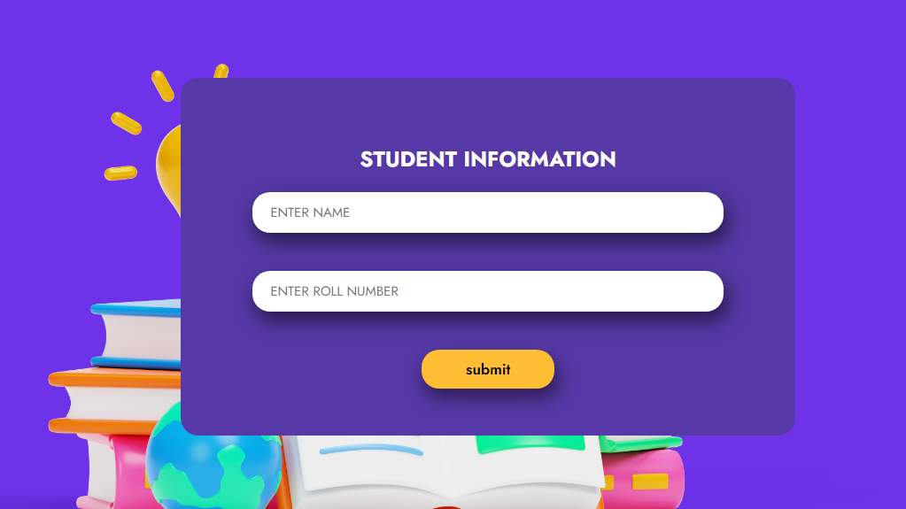

# Welcome to Your Ultimate JavaScript Quiz Experience!  

Dive into the world of JavaScript with our engaging and interactive quiz website. Whether you're a beginner eager to learn the basics or an experienced developer looking to challenge your knowledge, our platform is designed to make learning fun and effective.

 

  <h1>Key Features:</h1>

Interactive Quizzes: Test your JavaScript skills with a variety of questions covering all levels from basic to advanced. Each quiz is crafted to help you understand key concepts and improve your coding abilities.

Multiple-Choice Questions: Each question comes with four options to choose from, making it easier for you to test your knowledge and get immediate feedback.

Comprehensive Coverage: Our quizzes span a wide range of topics in JavaScript, including syntax, functions, arrays, objects, control flow, and more. This ensures a well-rounded understanding of the language.
 

 
Instant Feedback and Explanations: Receive immediate feedback on your answers with detailed explanations to help you understand the correct solutions and learn from any mistakes.

Progress Tracking: Keep track of your progress and see how much you have improved over time. Our system remembers your scores, so you can monitor your growth as you advance through the quizzes.

Responsive Design: Enjoy a seamless experience on any device. Our website is fully optimized for desktops, tablets, and smartphones, allowing you to learn and take quizzes on the go.

Beautiful and Intuitive Interface: Our clean and modern design ensures that navigating through quizzes is smooth and enjoyable. The user-friendly interface makes it easy to focus on learning without distractions.

Dark Mode: Switch to dark mode for a more comfortable viewing experience during night-time study sessions or in low-light environments.

